# Neural_Network_Charity_Analysis, Module 19 Challenge

With your knowledge of machine learning and neural networks, you’ll use the features in the provided dataset to help Beks create a binary classifier that is capable of predicting whether applicants will be successful if funded by Alphabet Soup.
From Alphabet Soup’s business team, Beks received a CSV containing more than 34,000 organizations that have received funding from Alphabet Soup over the years. Within this dataset are a number of columns that capture metadata about each organization, such as the following:
EIN and NAME—Identification columns
APPLICATION_TYPE—Alphabet Soup application type
AFFILIATION—Affiliated sector of industry
CLASSIFICATION—Government organization classification
USE_CASE—Use case for funding
ORGANIZATION—Organization type
STATUS—Active status
INCOME_AMT—Income classification
SPECIAL_CONSIDERATIONS—Special consideration for application
ASK_AMT—Funding amount requested
IS_SUCCESSFUL—Was the money used effectively

## Deliverable 1: Preprocessing Data for a Neural Network Model

The following preprocessing steps have been performed:
The EIN and NAME columns have been dropped.

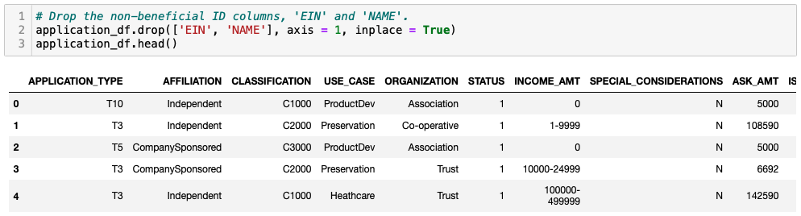

The columns with more than 10 unique values have been grouped together.

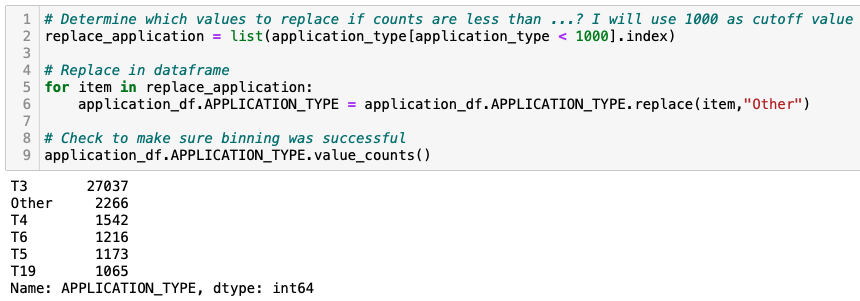

The categorical variables have been encoded using one-hot encoding.

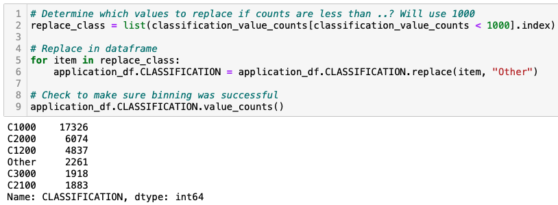

The preprocessed data is split into features and target arrays.

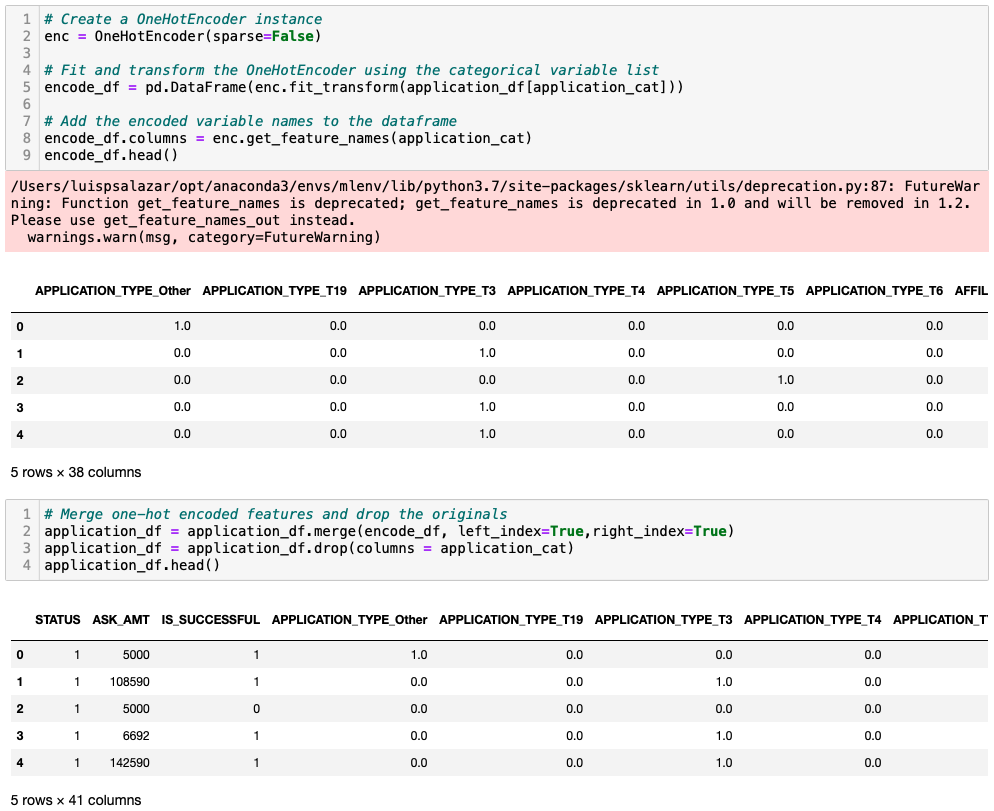

The preprocessed data is split into training and testing datasets.

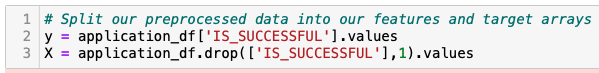

The numerical values have been standardized using the StandardScaler() module.

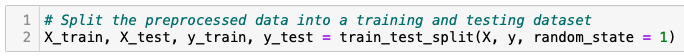

## Deliverable 2: Compile, Train, and Evaluate the Model

The neural network model using Tensorflow Keras contains working code that performs the following steps:
The number of layers, the number of neurons per layer, and activation function are defined (2.5 pt)

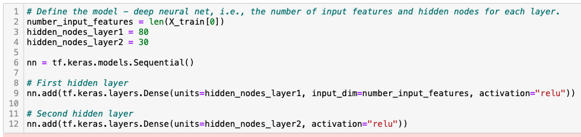

An output layer with an activation function is created.

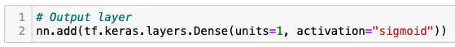

There is an output for the structure of the model.

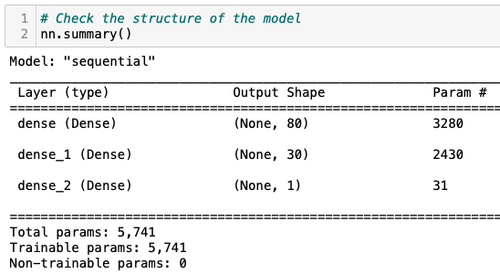

There is an output of the model’s loss and accuracy.

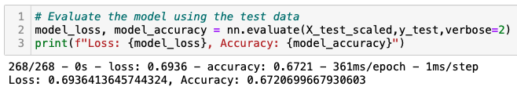

The model's weights are saved every 5 epochs.

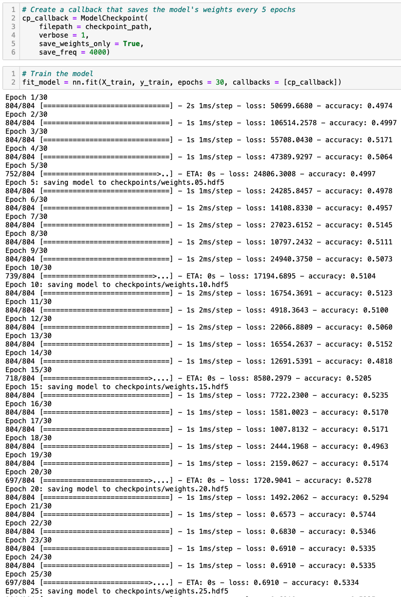

The results are saved to an HDF5 file.

## Deliverable 3: Optimize the Model

The model is optimized, and the predictive accuracy is increased to over 75%, or there is working code that makes three attempts to increase model performance using the following steps:
Noisy variables are removed from features (2.5 pt)

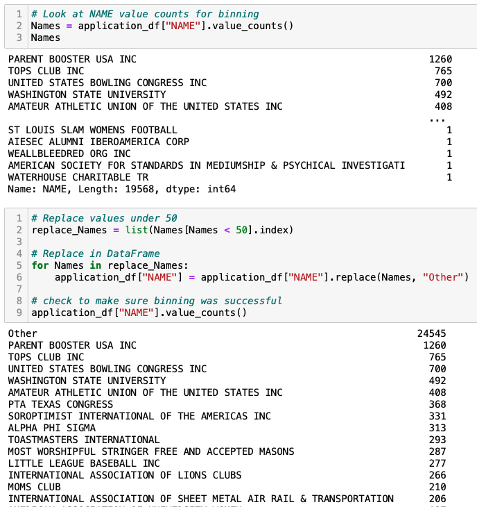

Additional neurons are added to hidden layers.

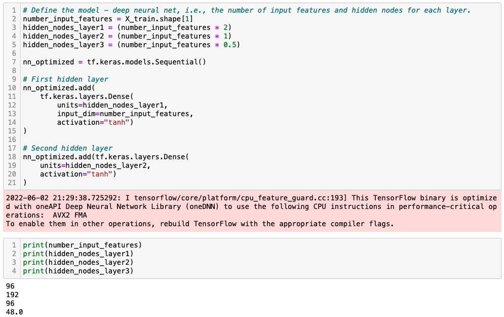

Additional hidden layers are added.

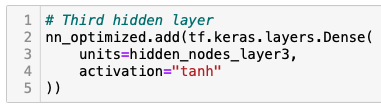

The activation function of hidden layers or output layers is changed for optimization.

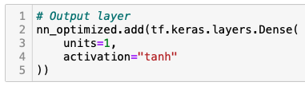

The model's weights are saved every 5 epochs.

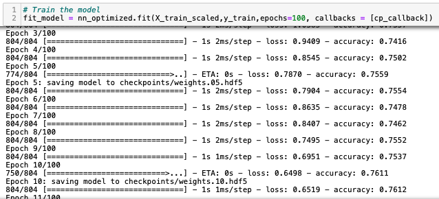

The results are saved to an HDF5 file.

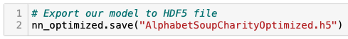

## Deliverable 4: A Written Report on the Neural Network Model

The written analysis has the following structure, organization, and formatting:
There is a title, and there are multiple sections (2 pt)
Each section has a heading and subheading (2 pt)
Links to images are working, and code is formatted and displayed correctly (2 pt).
Analysis (24 points)

The written analysis has the following:
Overview of the loan prediction risk analysis:
The purpose of this analysis is well defined (4 pt)
Results:
There is a bulleted list that answers all six questions (15 pt)
Summary:
There is a summary of the results (2 pt)
There is a recommendation on using a different model to solve the classification problem, and justification (3 pt)
