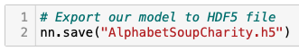

# Neural_Network_Charity_Analysis, Module 19 Challenge

## Deliverable 1: Preprocessing Data for a Neural Network Model

The following preprocessing steps have been performed:
The EIN and NAME columns have been dropped.

The columns with more than 10 unique values have been grouped together.

The categorical variables have been encoded using one-hot encoding.

The preprocessed data is split into features and target arrays.

The preprocessed data is split into training and testing datasets.

The numerical values have been standardized using the StandardScaler() module.

## Deliverable 2: Compile, Train, and Evaluate the Model

The neural network model using Tensorflow Keras contains working code that performs the following steps:

The number of layers, the number of neurons per layer, and activation function are defined.

An output layer with an activation function is created.

There is an output for the structure of the model.

There is an output of the model’s loss and accuracy.

The model's weights are saved every 5 epochs.

The results are saved to an HDF5 file.

## Deliverable 3: Optimize the Model

The model is optimized, and the predictive accuracy is increased to over 75%, or there is working code that makes three attempts to increase model performance using the following steps:

Noisy variables are removed from features.

* Column "NAME" was left to see if the model improves or not. When the value counts were less than 50, they were moved to the "OTHER" category

Additional neurons are added to hidden layers.

Additional hidden layers are added.

The activation function of hidden layers or output layers is changed for optimization.

The model's weights are saved every 5 epochs.

The results are saved to an HDF5 file.

## Deliverable 4: Report on the Neural Network Model

4.1. Purpose of this analysis

Using the features of the provided dataset, a binary classifier was developed, capable of predicting whether applicants will be successful or not, if funded by Alphabet Soup.

The Alphabet Soup’s CSV file contains more than 34,000 organizations that have received funding from Alphabet Soup over the years. Within this dataset are a number of columns that capture metadata about each organization:

EIN and NAME—Identification columns
APPLICATION_TYPE—Alphabet Soup application type
AFFILIATION—Affiliated sector of industry
CLASSIFICATION—Government organization classification
USE_CASE—Use case for funding
ORGANIZATION—Organization type
STATUS—Active status
INCOME_AMT—Income classification
SPECIAL_CONSIDERATIONS—Special consideration for application
ASK_AMT—Funding amount requested
IS_SUCCESSFUL—Was the money used effectively

4.2. Results:There is a bulleted list that answers all six questions (15 pt)

4.2.1 Data Preprocessing

What variable(s) are considered the target(s) for your model?

* The column "IS_SUCCESSFUL"  is the target for this analysis

What variable(s) are considered to be the features for your model?

* The following columns are the features, minus:

a) Base Case: "IS_SUCCESSFUL", plus "EIN" and "NAME" that were dropped
b) Optimized scenario: "IS_SUCCESSFUL", plus "EIN" that was dropped

What variable(s) are neither targets nor features, and should be removed from the input data?

"EIN" and "NAME" were removed as mentioned above.

4.2.2 Compiling, Training, and Evaluating the Model

How many neurons, layers, and activation functions did you select for your neural network model, and why?

* Initially, since there were 40 features, 80 nodes were used for the first hidden layer and 30 for the second layer. Relu was used as the activator.

Were you able to achieve the target model performance?

* No, in the initial neural model, the accuracy only reached 53%.

What steps did you take to try and increase model performance?

* The "NAME" column was used this time, the cutoff values were decreased from 1,000 to 500. The number of hidden layers increased from 2 to 3 and the nodes increased from 80 to 192. The activator was also changes to tanh and the number of epochs moved from 30 to 100. The accuracy increased to 76% and the loss dropped from 1.01 to 0.54.

4.3. Summary of the results

4.4. Recommendation on using a different model to solve the classification problem, and justification.

The Random Forest model was also evaluated, with just 100 estimators, an accuracy of 75% was achieved. But increasing the estimators did not improve its accuracy.

For this type of data, SVM and Gradient Boosting Tree could also be used.